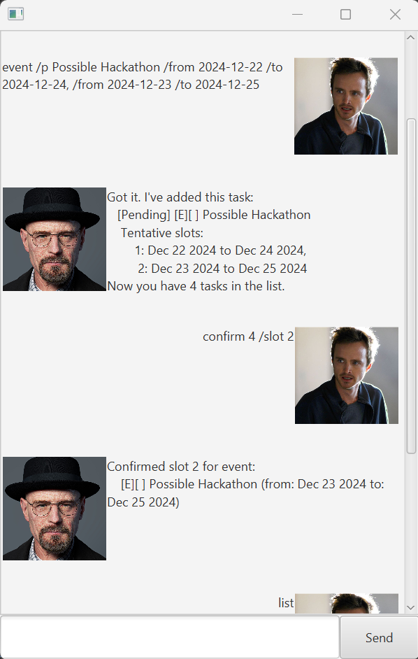

# BabbleBot User Guide




BabbleBot is a sophisticated task management tool designed specifically to enhance productivity and organization for both students and professionals. With BabbleBot, managing your daily tasks becomes simpler and more efficient. Whether you're juggling academic assignments, work deadlines, personal projects, or planning events, BabbleBot is tailored to meet all your scheduling needs with precision.

## Adding Todo

To add a todo task, enter the todo keyword, then specify the task description. BabbleBot will keep track of the task.


Example: `todo Study for upcoming stats exam /by 2024-12-22`

BabbleBot will confirm the addition of your todo task with the following output:

```
Got it. I've added this task:
    [T][ ] Study for upcoming stats exam
Now you have 1 tasks in the list.
```


## Adding deadlines

To add a deadline task, enter the deadline keyword, then specify the task description and the due date. BabbleBot will keep track of the task and the deadline.


Example: `deadline Finish AI homework /by 2024-12-22`

BabbleBot will confirm the addition of your deadline task with the following output:

```
Got it. I've added this task:
    [D][ ] Finish Al homework (by: Dec 22 2024) 
Now you have 1 tasks in the list.
```

## Adding events

To add a event task, enter the event keyword, then specify the task description and the start and end dates. BabbleBot will keep track of the task and its duration.


Example: `event Hackathon /from 2024-12-22 /to 2024-12-24`

BabbleBot will confirm the addition of your event task with the following output:

```
Got it. I've added this task:
    [E][ ] Hackathon (from: Dec 22 2024 to: Dec 24 2024) 
Now you have 1 tasks in the list.
```

## Adding tentative events

To add a tentative event task, enter the event keyword with the /p option, then specify the task description and the start and end dates, there can be many start and end dates. BabbleBot will keep track of the task and all possible timeslots.


Example: `event /p Possible Hackathon /from 2024-12-22 /to 2024-12-24, /from 2024-12-23 /to 2024-12-25`

BabbleBot will confirm the addition of your tentative event task with the following output:

```
Got it. I've added this task:
    [Pending] [E][] Possible Hackathon
    Tentative slots:
    1: Dec 22 2024 to Dec 24 2024,
    2: Dec 23 2024 to Dec 25 2024
Now you have 1 tasks in the list.
```


## Listing tasks

To view all your current tasks, including todo, deadline, event, and tentative event tasks, you can simply list them. BabbleBot will display all tasks in your task list, categorizing them by type and showing their status (complete [X] or incomplete [ ]).


Example: `list`

BabbleBot will display all your tasks. For example, if you have a mix of tasks, your output might look like this:

```
1. [T][X] Study for the upcoming algorithms exam 
2. [D][ ] Finish the machine learning homework (by: Sep 20 2024)
3. [E][] Hackathon (from: Sep 20 2024 to: Sep 24 2024)
```

## Marking tasks

To mark a task as completed, you'll need the task number from your list. For instance, if you want to mark the first task in your list as done, you would use:


Example: `mark 1`

BabbleBot will update the task's status to completed and provide confirmation:
```
Nice! I've marked this task as done:
    [T][X] Study for the upcoming algorithms exam
```

## Un-marking tasks

To unmark a task as completed, you'll need the task number from your list. For instance, if you want to unmark the first task in your list as done, you would use:


Example: `unmark 1`

BabbleBot will update the task's status to completed and provide confirmation:
```
OK, I've marked this task as not done yet:
    [T][ ] Study for the upcoming algorithms exam
```

## Deleting tasks

In BabbleBot, deleting tasks is a straightforward process that allows you to remove any task that is no longer relevant or was added by mistake. This helps maintain a clean and up-to-date task list.

To delete a task, you'll need the task number from your list. For example, if you want to delete the second task in your list, you would use:

Example: `delete 2`

BabbleBot will remove the specified task from your task list and provide confirmation:
```

Noted. I've removed this task:
    [E][] Possible Hackathon (from: Dec 23 2024 to:
Dec 25 2024)
Now you have 1 tasks in the list.
```

